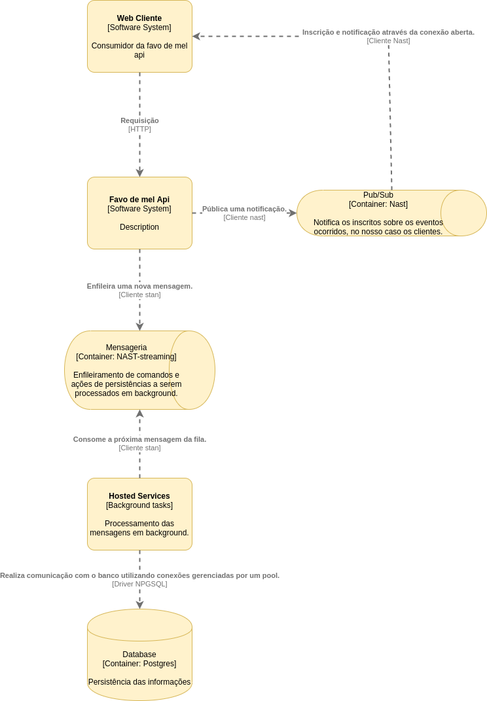

# Favo de mel
--------

## Problema
#### Descrição [aqui](https://github.com/douglas-tsc/ewave-mt-processo-seletivo/tree/master/temas/favo-de-mel).

--------

## Solução

O projeto teve como premissa evitar o máximo i/o em interações com o usuário, realizando primariamente as operações em memória, eventualmente persistindo esse resultado, para que isso pudesse acontecer, o resultados das operações eram enfileiradas e processadas posteriormente em background, não afetando o usuário. 

As operações dos recursos da api foram divididos entre sincronos e assincronos, pelo fato de que o recursos {pedidos} seriam altamente corridos pelos usuários, tendo simultaneamente tanto a cozinha quanto garçons podendo estar interagindo ao mesmo tempo, diferente das {comandas}, que somente os garçons manipulam e muitas das vezes cada comanda é responsabilidade de um único garçom, além de que suas regras não causarem nenhum tipo de inconsistência. 

As que são síncronas, são processadas assim que a requisição chega, primeiro em memória e enfileirada para eventualmente a persistência, diferentemente as assíncronas são recebidas, validadas, caso tudo esteja certo, são enfileiradas para serem processadas de forma assíncronas, mantendo a consistência. 

Por fim a interatividade da aplicação por parte dos usuários é alta, necessitando de uma resposta quase que imediata, onde quando envolve uma operação de um pedido, tanto os garçons quando a cozinha são interessados e precisam saber o que ocorre, podendo até incluir os clientes desses pedidos que poderia querer acompanhar o andamento de seus pedidos. 

Para isso, toda operação que ocorre emite um evento que se torna uma notificação para os interessados sobre o ocorrido, isso tudo acontece sobre mensageria através de "Publish-Subscribe", onde em cada operação ocorre uma publicação daquele evento e os clientes interessados estão inscritos, recebendo os eventos como notificação.

--------

## Resultado final

Para o que foi planejado uma única semana semana foi pouco, mas olhando para o lado positivo, para uma prova de conceito considero um bom resultado, com mais tempo conseguiria um resultado com certeza melhor. 

No final consegui de forma geral entregar a solução proposta, mas deixando em aberto débitos técnicos e coisas sem fazer, como: 
- Utilizar exceções somente em casos de exceções e casos não execepcionais um sistema de erros.
- Dados persistidos anteriormente não são realocados na memoria quando a aplicação é executadas novamente.
- Maior testabilidade com realmente uma pirâmide de testes, aumentando a qualidade e confiança, indo além dos testes unitários.
- Maior uso para testar manualmente.
- Abstração e refatoração de design que emergiram nos dias finais.
- Cobrir a aplicação de loggin.
- Auditar as operações e ações dentro da aplicação.
- Melhores estruturas de dados e algoritmos para as operações em memória para escalar.
- Autenticação e autorização dos usuários baseado nos roles: garçom e cozinha.
- Unificar a orquestração da infraestrutura de serviços necessários para suportar a aplicação em um docker compose (Tive problemas com o nast para fazer isso...).
- Organizar melhor o schema da api no swagger.
- Uso efetivo e correto do serviço de mensageria nast e nast-streaming e sua coexistência.
- E etc.

--------

## Executando a aplicação

### Infraestrutura de serviços

Após clonar o projeto, é necessario subir os serviços necessarios que suportam a aplicação:

Uma instancia do postegres:
> docker run --name postgres -e POSTGRES_USER=postgres -e POSTGRES_PASSWORD=postgres -e POSTGRES_DB=postgres -p 5432:5432 -d postgres

Uma instancia do nast:
> docker run -p 4223:4223 -p 8223:8223 -d nats:2.1-alpine -p 4223 -m 8223

Uma instancia do nast-streaming:
> docker run -p 4222:4222 -p 8222:8222 -d nats-streaming:0.18.0-alpine

--------

### Migration

Após todos serviços estarem levantandos, precisamos migrar o schema do banco:

Mova até o diretorio de migração:
> cd src/Infrastructure.Data/src/Migration

Execute a migração atraves da ferramenta evolve:
> ./evolve migrate postgresql -c "Server=127.0.0.1;Database=postgres;User Id=postgres;Password=postgres;" -l Scripts

--------

### Cliente para ouvir e visualizar as notificações

Acesse o repositorio do cliente de notificações e siga suas instruções:

[Repositorio](https://github.com/gfmcoding/client-notifications-favo-de-mel)

--------

### Buildando e executando a api

Para buildar:
> docker build . -t favodemelapi

Para executar:
> docker run --network="host" favodemelapi (Sei que não é o correto e sim criar uma rede e etc, mas por problemas tecnicos de ultima hora, vai assim...)

Acesse:
> /swagger/index.html

